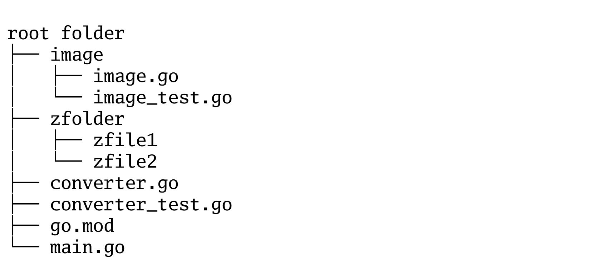

# gotree
Generate a txt filetree from a txt file.

The tool takes a txt-file with contains a simple structure:

```
folder1
    folder2
        file1
        file2
    folder3
```
 
Then it generates a tree structure.

```
folder1
    └── folder2
        └── file1
            ├── file2
            └── folder3
```

The tool has a very simple CLI. To send the tree to the stdout just write:

```
gotree path/to/input/file.txt
```
Version 1.0.3 supports some flags for generating a png image:

```
gotree -h
Usage of \bin\gotree:
  -img string
        filename for an output image (png).
  -imgw int
        defines the width, im img is set. (default 1700)
  -v    prints out the version
```

Example file:

```
root folder
    image
        image.go
        image_test.go
    zfolder
        zfile1
        zfile2
    converter.go
    converter_test.go
    go.mod
    main.go
```

Image output as png:


